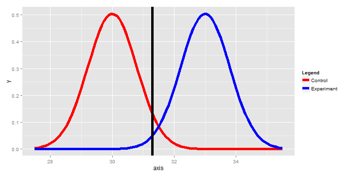

Power Analysis Calculator
========================================================
author: A. Moore
date: 4/22/2015

Introduction/Rationale
========================================================

Power is a fundamental concept within inferential statistics. For practitioners, an understanding of power guides credible research design and creates a criteria in which existing research can be held against.

- Power represents the probability that a test will successfully reject a null hypothesis, when the alternative hypothesis is ***true.***

- For this project, I present a simple calculator that can graphically assist students in understanding the relationship between **statistical power**, **sample size**, and **central tendency**.

Introduction/Rationale (Contd.)
========================================================

Power is most important when engaging in **frequentist** statistics, given that frequentist methods require a researcher to determine an acceptable alpha to test their hypotheses. However, while **Bayesian** statistics use collected data to test the weights of specific hypotheses, underpowered studies provide less informative evidence.
- http://en.wikipedia.org/wiki/Statistical_power

Regardless of the particular methods, power remains important in order to correctly interpret and understand phenomena that data describe.

Slide With Plot
========================================================

The Shiny app presented today does compute the standard t.test for power, based off the parameters set by the user. However, its primary feature is to visually display differences between a control and experimental condition.


```r
## This code is run within a renderPlot() in the server code.
## Users initialize respective parameters.
library(ggplot2)
n <- 40 #input$n
mua <- 33 #input$mua
mu0 <- 30 #input$mu0
sigma <- 5 #input$sigma
alpha <- .05 #input$alpha
```

Code Crafted
========================================================
width: 2000
height: 2000

```r
xitc <- mu0 + qnorm(1 - alpha) * (sigma / sqrt(n)) ## Line set by alpha
            
g <- ggplot(data.frame(axis = c(mu0 - (sigma / 2), mua + (sigma / 2))), aes(x = axis))
            
g <- g + stat_function(fun = dnorm, geom = "line", args = list(mean = mu0, sd = sigma / sqrt(n)), size = 2, aes(color = "a")) + ## Control group
    
    stat_function(fun = dnorm, geom = "line", args = list(mean = mua,
    sd = sigma / sqrt(n)), size = 2, aes(color = "b")) + ## Experimental Group
    
    geom_vline(xintercept = xitc, size = 2) ## Implment alpha line
```

Plot Example
===

```
[1] "Observed power: 0.75"
```

```r
g + scale_colour_manual("Legend", values = c("a" = "red", "b" = "blue"), labels = c("Control", "Experiment")) ## Set legend
```

 
